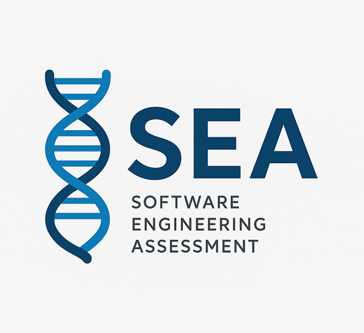

# Panel Pal

**Notice: This piece of software is in development as a university project and as yet is not a fully functioning or tested product. Additionally, ongoing maintenance and contributions to this code by the original developers will cease after 07/01/2025. Use of this software is at your own risk.**

SEA is a webapp prototype tool for annotating germline variant data using information from ClinVar. It uses API queries to get up to date information regarding NGS panels for alzheimers disease. It is designed to support clinical researchers (not bioinformaticians) working with experimental variant data from the Parkinson’s disease panel.

## Overview of Features

- Upload single or multiple VCF files through the web app
- Extract all variants from the uploaded VCFs
- Send variants to the Variant Validator API to:
    - normalise the variant
    - generate the correct RefSeq NC_ accession numbers
    - Use the NC_ numbers to query ClinVar for:
    - clinical significance
    - associated conditions
    - review status and supporting evidence
- Annotate each variant with the returned ClinVar data
- Store all annotated variants in an SQL database
- Avoid re-querying ClinVar by checking if a variant already exists in the database
- Search the database by:
    - variant
    - patient/sample ID
    - gene symbol 
    - transcript
    - clinical significance
- View all matching variants and their annotations through the web interface

## Getting Started
### Installation
To install and set up SEA_2025, see the [Installation Guide](installation.md).

### User Guide
To learn how to run each function in SEA_2025, please see the [User Manual](user_manual.md).

### Technical Manual
For bioinformaticians and other software developers looking to learn more about, or contribute to SEA_2025, please refer to the [Technical Manual](technical_manual.md)

## Continuous Integration
Automated unit and functional testing and continuous integration testing have been set up with GitHub Actions (see .github/workflows) and Jenkins CI (See Jenkinsfile).

## License
This project is licensed under the MIT License.

## Developers
- Arjun Ryatt - Trainee Bioinformatician, Oxford University Hospitals NHS Foundations Trust, NHS England
- Rebecca Sizer - Trainee Bioinformatician, North Bristol NHS Trust, NHS England
- Rachel Wellman - Trainee Bioinformatician, Royal Devon University Healthcare NHS Foundations Trust, NHS England