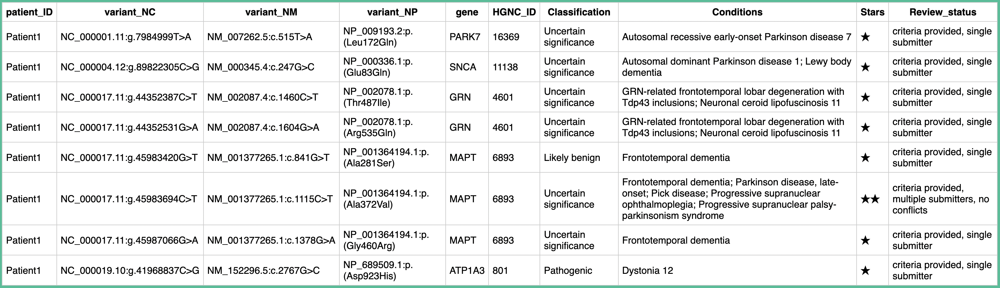

# User Manual
---

## 1. Introduction

### 1.1 What is SEA – Variant Database Query Tool?
SE_2025 (Software Engineering Assessment 2025) is a web-based application designed to annotate variants with variant information from ClinVar Variant Summary Records (VSRs). 

The tool provides a simple interface for uploading variants into an SQLite3 database along with annotations from ClinVar and subsequently querying, filtering and sorting data into a display table. Tables can be exported in CSV format.

### 1.2 Who is this manual for?
- Clinical Scientists  
- Trainees using SEA as part of their genomic data interpretation workflow
- Anyone installing or using the SEA application (Docker or local)

---

## 2. Key Features

- Upload VCF or CSV files through the flask app web interface  
- Automated retrieval of ClinVar annotations  
- Upload, query and filter SQLite3 databases of annotated variants
- View databases through the flask app web interface.
- Download annotated outputs in CSV format 
- Runs via Docker or directly on a local machine  

---

## 3. System Requirements

- Python **3.13**
- Git  
- Conda (for local installation)  
- Docker (optional but recommended)  
- Internet connection
- 2 GB of diskspace (recommended)
---

## 4. Installation Options

SEA can be installed using one of two methods:

### 4.1 Option A: Docker Deployment (Recommended)
A pre-configured Docker image ensures SEA runs consistently across systems.

### 4.2 Option B: Local Installation via Conda
Best suited for developers or users who want to modify or extend the application.

Full installation instructions are provided in the [**Installation Guide**](installation.md).  

---

## 5. Starting the Application

### 5.1 Start SEA using Docker
Run the following:

```bash
docker run -p 5000:5000 sea_app
```
Application URL:
http://localhost:5000

### 5.2 Start SEA locally (Conda)
```bash
conda activate sea_venv
python main.py
```
Then visit:
http://localhost:5000

--- 

## 6. Using SEA

### 6.1 Home Page Overview

The Home Page provides access to all core SEA functionality. 
Users can:
  - create new databases
  - add variants to existing databases
  - query existing databases
  - upload a database to query

#### Create or Add to a Database
This option allows users to create a new database or add variants to an existing one.

> Note: This process creates a database with ClinVar annotations for the uploaded variants, making them available for filtering, searching, and querying within the SEA web interface.

- Click **Choose files** to select one or more local variant files (files must be in `.csv` or `.vcf` format, and include the following fields: CHROM, POS, ID, REF, ALT).
- Enter the name of a new database or select an existing database from the dropdown menu.
- Click **Create database** to create a new database or update the selected database with the uploaded variants.
- While the database is being created or updated, the status message (**“Loading database. Please wait…”**) will be displayed and a spinner will appear in the **Create database** button. Processing time may vary depending on file size.
- If the upload is successful, a confirmation message (**`<database_name> created/updated successfully!`**) will appear.
- Any error messages will also be displayed if the upload fails.

#### Query an Existing Database
This option allows users to query a previously created database.

- Select a database from the **Database Selection** dropdown menu.
- Click **Open Selected Database** to open the query page for that database.
- The selected database will be loaded, allowing you to search the database by patient ID, variant or gene symbol.

#### Upload a Database for Querying
This option allows users to upload an existing database file for use within SEA.

> Note: Uploaded databases can be queried within SEA and may already contain ClinVar annotations.

- Click **Choose File** to select a local database file (file must have a `.db` extension).
- Click **Upload Database** to upload the file and make the database available for querying.
- While the database is being uploaded, a status message (**“Uploading database. Please wait…”**) will be displayed.
- If the upload is successful, a confirmation message (**`<database_name> uploaded successfully!`**) will appear.
- Any error messages will also be displayed if the upload fails.

### 6.3 Viewing and Querying an Existing Database page 

Once an existing database has been selected, it is possible to query the database by patient ID, variant, or gene symbol. Only one criteria can be searched by.

- **Search by Patient ID:** Select the patient ID from the dropdown menu or type it into the patient ID search bar, then click **Run Query**.  
- **Search by Variant:** Select the variant from the dropdown menu or type it into the variant search bar. The variant can be in one of the following formats:  
  - `NC_number:g.`  
  - `NM_number:c.`  
  - `ENST_number:c.`  
  - `gene_symbol:g.`  
  - `gene_symbol:c.`  
  Then click **Run Query**.  
- **Search by Gene Symbol:** Select the gene symbol from the dropdown menu or type it into the gene symbol search bar, then click **Run Query**.  

- If the query runs successfully, a results table similar to the following will appear:


---

### 6.4 Filtering Existing Database page

After querying or selecting a database, you can filter and sort the results to focus on specific content in the variant database.

- Click **Display Whole Database** on the **Viewing and Querying an Existing Database** page.  
  - This will display all entries in the database as well as sorting and filtering options.  

**Filtering:**  
  - You can filter the database by any of the following columns by selecting the desired option from the dropdown menu:  
    - `Patient_ID`  
    - `variant_NC`  
    - `variant_NM`  
    - `variant_NP`  
    - `gene`  
    - `HGNC_ID`  
    - `Classification`  
    - `Conditions`  
    - `Stars`  
    - `Review_status`  
  - Once you select a column to filter by, the **Filter Value** dropdown menu will auto-populate with the available values from that column, allowing you to select a specific value. If a **Filter Column** has not been selected, only **(none)** will appear in the the **Filter Value** dropdown menu.

**Sorting:**  
  - After filtering, you can sort the results by any of the following columns using the sort dropdown:  
    - `Patient_ID`  
    - `variant_NC`  
    - `variant_NM`  
    - `variant_NP`  
    - `gene`  
    - `HGNC_ID`  
    - `Classification`  
    - `Conditions`  
    - `Stars`  
    - `Review_status`  
  - This allows you to view filtered results in ascending order based on the selected column.

### 6.5 Downloading Annotated Output

After running a query or filtering the database, you can save the annotated results to your local device:

- Click **Export CSV** to download the output.  
- The exported file will be saved in the following format:  
  - `<database_name>.csv`  

> Note: Each export will create a new file with a sequential number if multiple exports are performed.

---

## 7. Troubleshooting
```

| Issue                     | Possible Cause                                         | Suggested Action                                                               |
|---------------------------|--------------------------------------------------------|--------------------------------------------------------------------------------|
| "File type not supported" | Selected file is not `.vcf` or `.csv`                  | Ensure your input file is in the correct format                                |
|---------------------------|--------------------------------------------------------|--------------------------------------------------------------------------------|
| Application not loading   | Docker not running, or Conda environment not activated | Start Docker or activate the Conda environment using `conda activate sea_venv` |
|---------------------------|--------------------------------------------------------|--------------------------------------------------------------------------------|
| No ClinVar results        | Variant absent in ClinVar or VCF formatting issue      | Verify the variant exists and the VCF file is correctly formatted              |
-----------------------------------------------------------------------------------------------------------------------------------------------------------------------
```
---

## 8. Frequently Asked Questions (FAQ)

- **Does SEA modify my original VCF file?**  
  No, SEA does not modify the original input file. All annotations are saved in a separate output file.  

- **Does SEA store uploaded files?**  
  No, uploaded files are used temporarily for processing and are not stored permanently.

- **Can I query multiple databases at once?**  
  No, SEA allows querying one database at a time. You can switch between databases using the database selection dropdown.

- **What file formats can I upload for creating a database?**  
  SEA accepts `.vcf` and `.csv` files for creating or updating a database.  

- **Can I filter or sort results after exporting?**  
  No, exported CSV files are static. To apply filters or sorting, use the SEA interface before exporting or open the CSV file in a spreadsheet program like Microsoft Excel.  

- **How are ClinVar annotations added to my database?**  
  SEA automatically queries ClinVar for each variant in the uploaded file and stores the annotations in the local database.  

- **What do the stars in the database table represent?**  
  Stars indicate the quality of the reviews made for a particular variant in ClinVar, from one (single submitter) to four (expert panel).

---

## 9. Support

For assistance, please contact the project maintainer or submit an issue on GitHub:  

- **Email:** rebecca.sizer@postgrad.manchester.ac.uk
- **GitHub Issues:** https://github.com/RebeccaSizer/Software_Engineering_Assessment_2025_AR_RW_RS/issues
